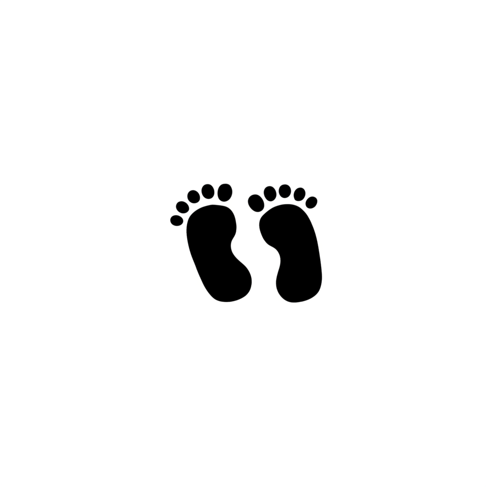

<div align="center">
  

  # Foot Path

  **Every step tells a story. Make yours count.**

  A focused, privacy-friendly step tracker built with Flutter. Foot Path turns your daily movement into clear progress—steps, distance, calories, and a week of momentum at a glance.

  [](https://flutter.dev)
  [](https://dart.dev)
  [](https://www.android.com)
  [](https://bloclibrary.dev)
  [](https://pub.dev/packages/hive_ce)
</div>

---

## Why Foot Path?

Foot Path is designed to keep the important things simple: start tracking, see how far you have come, and return tomorrow with a goal worth reaching. Your activity history is stored locally on your device.

## Highlights

- **Live step tracking** — read motion-sensor step counts as you move.
- **Stay on track** — set a personal daily goal and watch your progress ring fill up.
- **Meaningful stats** — see estimated distance and calories alongside your step count.
- **Your week in view** — explore the last seven days in a clean, goal-aware chart.
- **Fits your preferences** — choose light, dark, or system theme; metric or imperial distance units.
- **Built to keep going** — Android foreground tracking keeps Foot Path active with a low-priority status notification.
- **Local by design** — daily records and settings are persisted on-device with Hive; no account is required.

## Tech at a glance

| Layer | Tools |
| --- | --- |
| App framework | Flutter & Dart |
| State management | BLoC / flutter_bloc |
| Step sensor | pedometer |
| On-device storage | Hive CE & Shared Preferences |
| Charts | fl_chart |
| Background tracking | flutter_foreground_task |

## Getting started

### Prerequisites

- [Flutter SDK](https://docs.flutter.dev/get-started/install) (compatible with Dart `^3.12.2`)
- An Android phone or emulator with a step sensor
- Android Studio or another configured Android toolchain

### Run it locally

```bash
git clone <your-repository-url>
cd foot_path
flutter pub get
flutter run
```

To confirm that your environment is ready, run:

```bash
flutter doctor
flutter test
```

## Permissions

Foot Path asks for only what it needs to record steps reliably on Android:

| Permission | Why it is needed |
| --- | --- |
| Activity recognition | Accesses the device step counter. |
| Foreground service | Continues tracking when the app is not open. |
| Notifications | Shows the ongoing tracking notification on supported Android versions. |
| Wake lock | Helps avoid interruptions while a tracking session is active. |

## How it works

1. Tap **Start Tracking** on the dashboard and grant the requested permission.
2. Foot Path listens to your device's step counter and keeps an ongoing notification while tracking.
3. Today's progress, estimated distance, and calorie estimate update in the dashboard.
4. Daily totals are saved locally and appear in the weekly history chart.

> Distance and calorie values are estimates, based on an average stride length and calories per step. They are motivational indicators, not medical measurements.

## Project structure

```text
lib/
├── core/           # Theme and calculation utilities
├── data/           # Sensor, local storage, and repository implementations
├── domain/         # App entities and repository contracts
└── presentation/   # BLoCs, screens, and reusable widgets
```

## Contributing

Ideas, issues, and pull requests are welcome. For a code change, please run `flutter analyze` and `flutter test` before opening a pull request.

---

<div align="center">
  Made for the everyday journey—one step at a time. 👟
</div>
